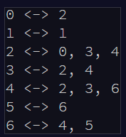

# Day 12 Digital Plumber

## Part 1

>Walking along the memory banks of the stream, you find a small village that is experiencing a little confusion: some programs can't communicate with each other.
>
>Programs in this village communicate using a fixed system of pipes. Messages are passed between programs using these pipes, but most programs aren't connected to each other directly. Instead, programs pass messages between each other until the message reaches the intended recipient.
>
>For some reason, though, some of these messages aren't ever reaching their intended recipient, and the programs suspect that some pipes are missing. They would like you to investigate.


Each of these "programs" has one or more other "programs" it can communicate with, bi-directionally.

>You need to figure out how many programs are in the group that contains program ID 0.
>
>For example, suppose you go door-to-door like a travelling salesman [<-- lol](https://en.wikipedia.org/wiki/Travelling_salesman_problem) and record the following list:



This grouping has 6 "programs" connected to the 0th "program"

For our actual input we are looking at a large text file, the first 6 lines of which look like: 
```0 <-> 780, 1330
1 <-> 264, 595, 1439
2 <-> 296, 531, 1440
3 <-> 207, 235, 1038
4 <-> 554, 1295
5 <-> 159, 568, 1381
6 <-> 1134
```


```  static string[][] input = File.ReadAllLines(@"day12.txt")
    .Select(x => x.Split(' '))
    .ToArray();
```
>using LINQ for the first time here, we split the text on the spaces so that we're just dealing with the values


This problem also taught me to use REGEX (Whoo! REGEX!)
```string pattern = @"\d";

for (int i = 0; i < input.Length;)
    {
        for (int j = 0; j < input[i].Length; j++)
        {
            //get rid of all but the digits in the file
            input[i][j] = Regex.Replace(input[i][j], "[^0-9]", "");
            Match match = Regex.Match(input[i][j], pattern);
            if (match.Success)
            {
                int current = Int32.Parse(input[i][j]);

                //check if the hash contains the number already to prevent having to check the same values 
                //multiple times
                if (!hash.Contains(current))
                {
                    stack.Push(current);
                }
                hash.Add(current);
            }
        }
        if (stack.Count > 0) { i = stack.Pop(); }
        else { Console.WriteLine(hash.Count()); return; }
    }
```

Counting the total groups by the above method we get: 

### Our Answer: 380

## Part 2

Here we are tasked with counting the total number of isolated groups of "programs"

In order to achieve this I wrote: 

``` //once allsets has been populated with all of the sorted sets in "hash" we check each one to see if it is 
            //setequal to another and if it is we remove it, leaving us with just the unique values in our allsets.count
            //this is super ugly code... my apologies to my future self.
            for (int i = 0; i < allSets.Count - 1; i++)
            {
                for (int j = i + 1; j < allSets.Count; j++)
                {
                    if (allSets[i].SetEquals(allSets[j]))
                    {
                        allSets.Remove(allSets[i]);
                        i--;
                        break;
                    }
                }
            }
            Console.WriteLine("The number of unique sets in allSets is: {0}", allSets.Count);
```

Apology not accepted. Thank God I've learned to write cleaner and less convoluted code in my time at Tech Elevator! 

### Our Answer: 181


