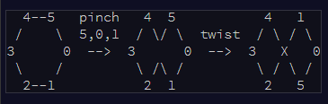

# Day 10 Knot Hash
 
 ## Part 1
 
 >This hash function simulates tying a knot in a circle of string with 256 marks on it. Based on the input to be hashed, the function repeatedly selects a span of string, brings the ends together, and gives the span a half-twist to reverse the order of the marks within it. After doing this many times, the order of the marks is used to build the resulting hash.
 
 

>To achieve this, begin with a list of numbers from 0 to 255, a current position which begins at 0 (the first element in the list), a skip size (which starts at 0), and a sequence of lengths:
>> _225,171,131,2,35,5,0,13,1,246,54,97,255,98,254,110  <-- my actual input_
>
> Then, for each length:   
> 1. Reverse the order of that length of elements in the list, starting with the element at the current position.
> 2. Move the current position forward by that length plus the skip size.
> 3. Increase the skip size by one.
> The list is circular; if the current position and the length try to reverse elements beyond the end of the list, the operation reverses using as many extra elements as it needs from the front of the list. If the current position moves past the end of the list, it wraps around to the front. Lengths larger than the size of the list are invalid.

So basically we are taking sections of a collection of integers from 0 to 255, called our 'input', and based on a number from a set of "rules", then we reverse that section of our input and then move our current position forward by that "rule" number + our 'skip-size' which is just an integer that starts at 0 and increments by one each iteration. We do this for each of our "rules" and then we multiply the first 2 numbers of our now scrambled 'input' together to verify whether we performed this function correctly. 

The real challenge of this Day was the fact that C# doesn't provide a way to stop you from going over the end of a collection and ending up with OutOfBounds Exceptions. 

In order to overcome that I used this block of code

```   for (int j = 0; j < integersToHashSize; j++)
{
    if (copyOfCurrentIndex1 < integersToHashSize)//while the current index is within the bounds of the list we copy
    {                                            //the values in the copy of our main list back into the official list
        integersToHash[copyOfCurrentIndex1] = copyOfIntegersToHash[j];
    }
    else                                         //once the current index would go out of bounds of the array we reset the index
    {                                            //and continue to add the copy values back into the official list
        copyOfCurrentIndex1 = 0;
        integersToHash[copyOfCurrentIndex1] = copyOfIntegersToHash[j];
    }
    copyOfCurrentIndex1++;
}
```

resetting the index back to 0 and going from there if the function would otherwise have gone out of bounds

## Part 2

For Part 2 we are going to run the Knot Hash many times in order to get a more randomized result.

1. though, we convert our "rules" to ASCII codes so that no matter what rules we get they are never larger than 255

After we have converted our rules we append them with the following sequence of ASCII codes ( 17, 31, 73, 47, 23 )

```static List<int> AsciiConverter(List<int> rules)
   {
       int size = rules.Count();

       //concatenate all integers in rules as comma separated values in a string
       string rulesString = string.Join(",", rules.ToArray());

       foreach (char c in rulesString)
       {
           //converting characters to integers creates their ASCII counterparts
           int unicode = c;
           rules.Add(unicode);
       }
       rules.RemoveRange(0, size);

       //add this end sequence as provided by the instructions
       int[] endSequence = { 17, 31, 73, 47, 23 };

       rules.AddRange(endSequence);
       return rules;
   }
```

2. We will run this hash 64 times, producting a "Sparse Hash" of the numbers 0 to 255 in some random order.
> in order to make this into a "Dense Hash" we will need to reduce this down to 16 numbers by performing a bitwise XOR to combine each 
> block of 16 numbers into one number.


