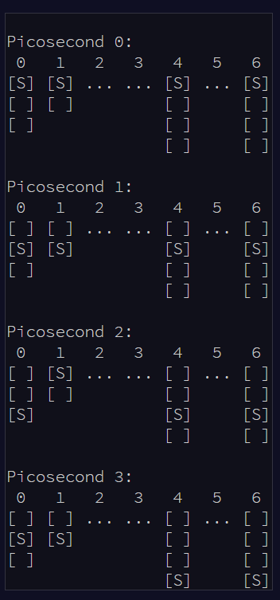

# Day 13 Packet Scanners

## Part 1

>You need to cross a vast firewall. The firewall consists of several layers, each with a security scanner that moves back and forth across the layer.
>
>By studying the firewall briefly, you are able to record (in your puzzle input) the depth of each layer and the range of the scanning area for the scanner within it,
written as depth: range. Each layer has a thickness of exactly 1.  A layer at depth 0 begins immediately inside the firewall;
a layer at depth 1 would start immediately after that.

Basically here we are tasked with "moving" through a series of "scanners" that are will "catch" you if you happen to be occupying the 
same index as them on the same iteration of the loop. This turned out to be deceptively difficult. 

This would be an example iteration: 


Here we are "caught" in layers 0 and 6. Our job is to calculate the "severity" of our trip by multiplying the "depth" we are at
when we are caught by the the "range" of that particular scanner. 

Our individual input looks like this: 

> 0: 5  
1: 2  
2: 3  
4: 4  
6: 6  
8: 4  
10: 6  
12: 10  
14: 6  
16: 8  
18: 6  
20: 9  
22: 8  
24: 8  
26: 8  
28: 12  
30: 12  
32: 8  
34: 8  
36: 12  
38: 14  
40: 12  
42: 10  
44: 14  
46: 12  
48: 12  
50: 24   
52: 14  
54: 12  
56: 12  
58: 14  
60: 12  
62: 14  
64: 12  
66: 14  
68: 14   
72: 14  
74: 14  
80: 14  
82: 14  
86: 14  
90: 18  
92: 17  

To solve this I converted each line into a set of KeyValuePairs (I didn't know about Dictionaries at the time, though I'm not sure
they'd be perfect here at any rate, instead I made my own class)

```
class KeyValuePair
{
    public double index;
    public double range;
    public KeyValuePair(double index, double range)
    {
        this.index = index;
        this.range = range;
    }
}
```

Then...

```
while ((line = file.ReadLine()) != null)
{
   string[] eachLine = line.Split(myExpression);
   KeyValuePair kp = new KeyValuePair(Convert.ToDouble(eachLine[0]), Convert.ToDouble(eachLine[1]));
   keyValuePairList.Add(kp);
}
file.Close();
```


After that I ran them through the following algorithm in order to keep track of the severity of my collisions. 

```
for (double i = 0; i < 93; i++)
{
    foreach (KeyValuePair kp in keyValuePairList)
    {
        if (kp.index == i && i % ((kp.range * 2) - 2) == 0)
        {
            count += (kp.range * kp.index);
        }
    }
}
Console.WriteLine(count);
```

## Our Answer: 788
  
