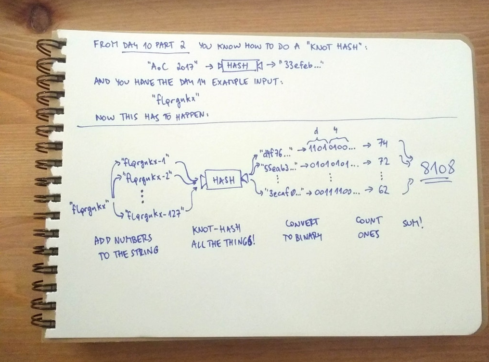

# [Day 14 - Disk Defragmentation](http://adventofcode.com/2017/day/14)

>Suddenly, a scheduled job activates the system's disk defragmenter. Were the situation different, you might sit and watch it for a while,
but today, you just don't have that kind of time. It's soaking up valuable system resources that are needed elsewhere,
and so the only option is to help it finish its task as soon as possible.

Here we are going to be re-using our code from Day 10 to create knot hashes of our disk in question, a 128 by 128 grid of *free* and *used* 
spaces. 

## Our input will be: stpzcrnm

Our job is to append to this input a dash followed by the numbers 0 through 127 (128 numbers using zero-indexing)
which we accomplish with a simple for loop with one oddity

```
static void NumberTheInputs(string inputToAddend)
{
    List<string> inputs = new List<string>();

    string inputCopy = inputToAddend;

    for (int i = 0; i < 128; i++)
    {
        inputToAddend = inputCopy;
        inputToAddend += "-" + i.ToString();
        inputs.Add(inputToAddend);
    }...
```
Notice that I had to make a copy of the input string because it needed to be refreshed each time I iterated the loop. Took this out
originally during a refactor but needed to put it back in. 

>The output of a knot hash is traditionally represented by 32 hexadecimal digits; each of these digits correspond to 4 bits,
for a total of 4 * 32 = 128 bits. To convert to bits, turn each hexadecimal digit to its equivalent binary value,
high-bit first: 0 becomes 0000, 1 becomes 0001, e becomes 1110, f becomes 1111, and so on; a hash that begins with a0c2017...
in hexadecimal would begin with 10100000110000100000000101110000... in binary.

The result of this is a grid of 0's and 1's (or any other hex chars you'd like to make a binary representation out of)

Our task is to count the number of "used" spaces (1's in our case)

An extremely nice Redditor in the Advent of Code community going by the username u/janiczek created the following image to 
help clarify these somewhat confusing instructions: 



After a series of methods from Day 10 and one or 2 from the current Day as well:
```
foreach (string s in inputs)
{
    List<int> numbers0To255 = Enumerable.Range(0, 256).ToList();

    List<int> AsciiConverted = AsciiConverter(s);

    List<int> KnotHashed = Day10.Part2.KnotHash(input: numbers0To255, rules: AsciiConverted);

    List<int> bitWiseInts = Day10.Part2.BitwiseXOR(KnotHashed);

    string result = Day10.Part2.ConvertToHex(bitWiseInts);

    string binary = convertToBinary(result);

    Console.WriteLine(binary);

    CountOnes(binary);
}
```

We got the following correct answer: 

### Our Answer: 8250

## Part 2

This part was a definite challenge. It took me hours to figure this one out, but coming out of that, I feel I'm a much better programmer
with a way better understanding of recursion. Why recursion? Well because our task was to...

>Now, all the defragmenter needs to know is the number of regions. A region is a group of used squares that are all adjacent, not including diagonals. Every used square is in exactly one region: lone used squares form their own isolated regions, while several adjacent squares all count as a single region.

As you can see, with the goal being to count the number of "islands" of 1's in metaphorical "seas" of 0's we needed a method to 
iterate over our binary file and be able to understand where those delineations were. 

Eventually I came up with the following algorithm:

```
        //checks the array for 1's and changes the 1's
        public static void FloodFill(int i, int j)
        {
            //current position in the input array is defined by int a and b
            //if c is equal to '1' then great
            //else move on to the next one

            int verticalPosition = i;
            int horizontalPosition = j;


            characterChanger(ref inputArray[verticalPosition][horizontalPosition]);


            if (horizontalPosition - 1 >= 0 && inputArray[verticalPosition][horizontalPosition - 1] == '1')
            {
                FloodFill(verticalPosition, horizontalPosition - 1);
            }
            if (horizontalPosition + 1 < inputArray[verticalPosition].Length && inputArray[verticalPosition][horizontalPosition + 1] == '1')
            {
                FloodFill(verticalPosition, horizontalPosition + 1);
            }
            if (verticalPosition + 1 < inputArray.Length && inputArray[verticalPosition + 1][horizontalPosition] == '1')
            {
                FloodFill(verticalPosition + 1, horizontalPosition);
            }
            if (verticalPosition - 1 >= 0 && inputArray[verticalPosition - 1][horizontalPosition] == '1')
            {
                FloodFill(verticalPosition - 1, horizontalPosition);
            }

        }
```

This algorithm asks each char whether it is a 1 or not. If it is, it stops what it is doing and iterates over all of that chars neighbors asking the same question, and likewise with the results therein. For a human, that gets pretty confusing pretty quickly but I learned here to rely on the machine to be able to think faster than I could. I just needed to provide it specific instructions. 

I made the console output pretty for fun. 


