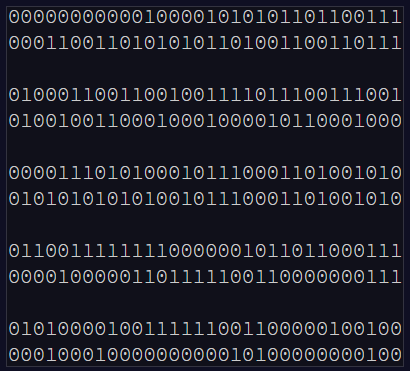

# [Day 15 Dueling Generators](http://adventofcode.com/2017/day/15)

Here our problem was we had 2 "generators" each producing binary strings based on a fairly simple algorithm of taking a previous value 
multiplying it by a constant factor (my input) and then keeping the remained of dividing that number by 2,147,483,647

Each generator then converts its number to binary and a "judge" looks at the values in pairs.



If the judge sees that the lowest 16 digits of the pair are the same that counts as a hit. After the iterations are complete the total 
number of hits is our answer. 

Just one small problem. 

We need to run the iteration 40 MILLION times to get a large enough sample size for the "judge"
<br />
<br />
<br />
<br />
<br />
<br />
<br />
<br />
<br />
<br />
<br />
<br />
<br />
<br />
<br />
<br />
<br />
<br />
<br />
<br />
<br />
<br />
<br />
<br />
<br />
<br />
<br />
<br />
<br />
<br />
<br />
<br />
<br />
<br />
<br />
<br />
<br />
<br />
<br />
<br />
<br />
<br />
<br />
<br />
<br />
<br />
<br />
<br />
<br />
<br />
<br />
<br />
<br />
<br />
<br />
<br />
<br />
<br />
<br />
<br />
<br />
<br />
<br />
<br />
<br />
<br />
<br />
<br />
<br />
<br />
<br />
<br />
<br />
<br />
<br />
<br />
<br />
<br />
<br />
<br />
<br />
<br />
<br />
<br />
<br />
<br />
<br />
...

<br />
<br />
<br />
<br />
<br />
<br />
<br />
<br />
<br />
<br />
<br />
<br />
<br />
<br />
<br />
<br />
<br />
<br />
<br />
<br />
<br />
<br />
<br />
<br />
<br />
<br />
<br />
<br />
<br />
<br />
<br />
<br />
<br />
<br />
<br />
<br />
<br />
<br />
<br />
<br />
<br />
<br />
<br />
<br />
<br />
<br />
<br />
<br />
<br />
<br />
<br />
<br />
<br />
<br />
<br />
<br />
<br />
<br />
<br />
<br />
<br />
<br />
<br />
<br />
<br />
<br />
<br />
<br />
<br />
<br />
<br />
<br />
<br />
<br />
<br />
<br />
<br />
<br />
...

<br />
<br />
<br />
<br />
<br />
<br />
<br />
<br />
<br />
<br />
<br />
<br />
<br />
<br />
<br />
<br />
<br />
<br />
<br />
<br />
<br />
<br />
<br />
<br />
<br />
<br />
<br />
<br />
<br />
<br />
<br />
<br />
<br />
<br />
<br />
<br />
<br />
<br />
<br />
<br />
<br />
<br />
<br />
...

<br />
<br />
<br />
<br />
<br />
<br />
<br />
<br />
<br />
<br />
<br />
<br />
<br />
<br />
<br />
<br />
<br />
<br />
<br />
<br />
<br />
<br />
<br />
<br />
<br />
<br />
<br />
<br />
<br />
<br />


yeah, I did a lot of staring at just that for awhile waiting for my computer to process this one.
In the end my algorithm takes about 45 seconds to run on my laptop. 

It looks like this
```
static int MathCheck(long a, long b, int numberOfCycles)
        {
            int count = 0; //used to count the number of matching strings of binary hashes. This is the return value.

            long generatorA = 16807, generatorB = 48271, divideBy = 2147483647; //provided by the website for use in hashing our seeds
            long genAPreviousState = a, genBPreviousState = b; //the number updated on each cycle of the hash

            for (int i = numberOfCycles - 1; i >= 0; i--)
            {
                string GeneratorAString = Convert.ToString((generatorA * genAPreviousState) % divideBy, 2).PadLeft(32).Remove(0, 16); //the binary string of the previous state after the hashing algorithm
                string GeneratorBString = Convert.ToString((generatorB * genBPreviousState) % divideBy, 2).PadLeft(32).Remove(0, 16);
                genAPreviousState = (generatorA * genAPreviousState) % divideBy; //the hashing algorithm
                genBPreviousState = (generatorB * genBPreviousState) % divideBy;

                if (GeneratorAString.Equals(GeneratorBString)) // Checks to see if each string matches the other. Increments the count when the match.
                {
                    count++;
                }
            }
            return count;
        }
```
### Our Answer: 638

## Part 2

Now the judge is getting a little more stringent on what they will accept

Each "generator" can only submit values that are divisible by 4 or 8 respectively. The judge doesn't want them all random though
so they wait for each generator to hand in a value before comparing them. Because this is more data intensive the judge is only
asking for 5 million results this time. 

Obviously the ante is being upped here by asking each generator to find storage for 5 million pairs in order to compare them. 
This of course means that each generator has to produce 5 million iterations that are divisible by their respective number!

This might not be the cleanest solution but this is how I generated those numbers:
```
//40 million cycles to generate the 5 million binary hashes
for (int i = 0; i < numberOfCycles; i++)
{
    if (genAPreviousState % 4 == 0)
    {
        if (A_Array_Incrementer < 5_000_000) //increment up to 5 million
        {
            GeneratorAStringArray[A_Array_Incrementer] = Convert.ToString(genAPreviousState, 2).PadLeft(32).Remove(0, 16); //convert numbers to binary and leave only the lowest 16 digits
            A_Array_Incrementer++;
        }
    }
    genAPreviousState = (generatorA * genAPreviousState) % divideBy; //the hashing algorithm provided by the website

}
```

After doing that for each of the generators, the rest of the problem was very similar to Part 1. 

### Our Answer: 343

