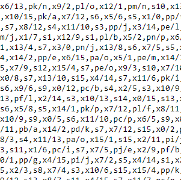

# [Day 16 Permutation Promenade](http://adventofcode.com/2017/day/16)

>You come upon a very unusual sight; a group of programs here appear to be dancing.
>
>There are sixteen programs in total, named a through p. They start by standing in a line:
a stands in position 0, b stands in position 1, and so on until p, which stands in position 15.

Our instructions look like a lot of this:

etc...

I solved this one by parsing all of that information into a string array and checking what the 0th index of the array is. 
Using that "dance instruction" I adjusted the list as per the rules. 

It looks like a lot of this kind of thing..

```
if (danceInstructions[i][0] == 's')//we check every index for it's dance instruction char, it will always be the first char
{
    string temp = danceInstructions[i];
    temp = temp.Remove(0, 1);//get rid of the dance instruction char, leaving us with only the number 
    int numberOfProgramsToMove = int.Parse(temp);

    //replace the string of programs with a concatenation of the last x number of programs 
    //(determined by the previous steps number) followed by the first group up to that number
    stringOfDancingPrograms = stringOfDancingPrograms.Substring(stringOfDancingPrograms.Length - numberOfProgramsToMove)
                    + stringOfDancingPrograms.Substring(0, stringOfDancingPrograms.Length - numberOfProgramsToMove);
}
```

This got us where we wanted to go. At the end of the dance
### Our Answer: cknmidebghlajpfo

## Part 2

The programs really enjoyed that. Now they want to do it again right from where they left off 
*1 BILLION TIMES*

I definitely gave brute forcing this solution a shot, but honestly it's just too complex. After waiting half an hour for a solution to be 
met with an OutOfMemory Exception I decided to try different avenues.

After consulting with Reddit as I do when I need a little help I discovered that 

> // The key realization is that the code cycles after 60 (in my case) dances  
> // So the anwer to the question is to divide 1 billion by 60 and then using the   
> // modulo of that same division as the number of extra times you need to  
> // run your hash or dance to find the proper order of program-dancers ("abcd...")  

### Our Answer: cbolhmkgfpenidaj
