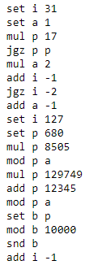
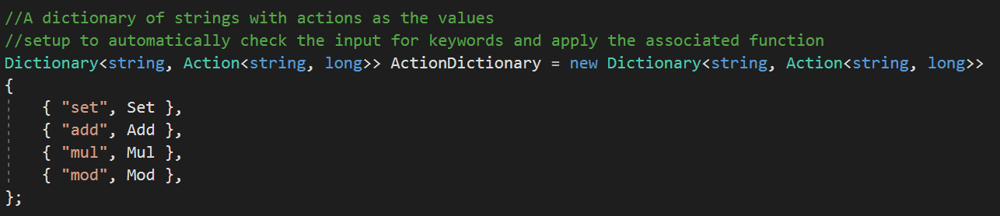
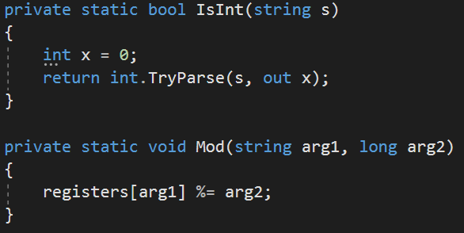

# [Day 18 - Duet](http://adventofcode.com/2017/day/18)

Today we discover a tablet containing some strange assembly code simply labeled "Duet" In our attempt to play the code we
discover a set of simple rules within. 

The assembly is meant to operate on a set of *registers* that are each nameed with a single letter and can hold a single *interger*.
Each register is initialized to 0.

There are only a few instructions: 

* snd X *plays a sound* with the frequency equal to the value of X 
* set X Y *sets* X to the value of Y  
* add X Y *increases* the register X by the value Y  
* mul X Y sets register X to X *= Y  
* mod X Y sets register X to the *remainder*  of X  / Y  
* rcv X *recovers* the frequency of the last sound played but only if X != 0 <-- this is our final value if the criteria are met
* jgz X Y *jumps* with an offset of Y, but only if X > 0 (negatives allowed)

Our input looks like: 


An interesting way to handle this problem is a Dictionary of string(letters) Keys with Action Values. 
This seems like it would be a pretty straightforward solution to parse the input file by the first letter and adjust the value contained by that letter accordingly but there are a couple of things
that can make this a little more complicated. 


<br>


The first is that some of the instructions (like the second from the bottom) have no third 
value. If you were to try to parse this file with no third value when it was expected, the machine would throw a not set to instance of object
exception. 

Looking through the list of instructions it's notable that only "snd" and "rcv" have possible empty 3rd values. Therefore we check for
that with these lines: 

```
if (instructions[j][0] == "snd")//stores the latest "sound" in lastSoundPlayed
{
    lastSoundPlayed = registers[instructions[j][1]];
    continue;
}
if (instructions[j][0] == "rcv")//Where the program terminates. Only if the second piece of the array is 0.
{
    if (registers[instructions[j][1]] != 0)
    {
        finalAnswer = lastSoundPlayed;
        Console.WriteLine(finalAnswer);
        return;
    }
    continue;//must continue so that other instructions are not accidentally executed.
}
```

The other difficulty we face is that some of the 3rd values are letters instead of integers. In order to get around this we 
sometimes have to temporarily replace that letter with whatever value is being stored in it at the moment. The rest of the 
instructions carry on as usual during this but when it happens it trips a boolean flag that lets the method know on the next iteration
that it needs to replace that now-integer with whatever letter it had formerly possessed. 

After all of this we obtain the following answer
 
### Our Answer: 3188

