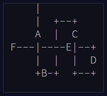
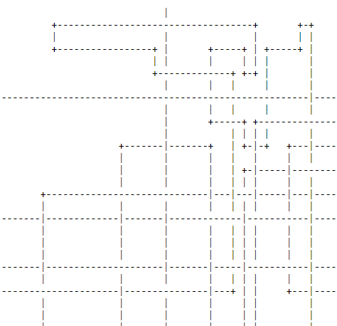
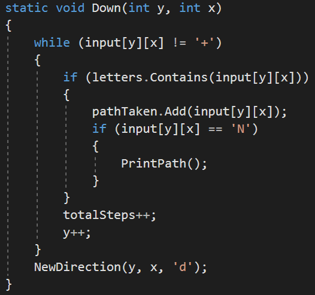
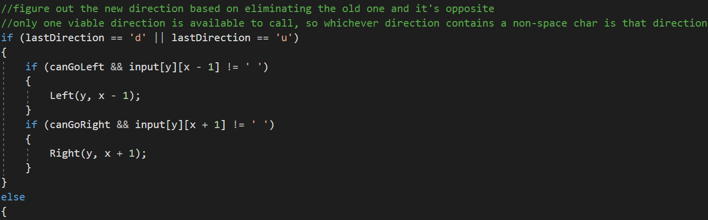

# [Day 19 - A Series of Tubes](http://adventofcode.com/2017/day/19)

A network packet has gotten lost in a maze! It's trying to follow a routing diagram (the puzzle input) but it's confused about 
where to go. 

>Its starting point is just off the top of the diagram. Lines (drawn with |, -, and +) show the path it needs to take,
starting by going down onto the only line connected to the top of the diagram. It needs to follow this path until it reaches
the end (located somewhere within the diagram) and stop there.

With the gurantee that the maze will have an entry point at the top of the maze, our task is to find the order that the letters 
occur in. In the example the answer would be ABCDEF. 

So oviously just read the file with your eyes and report back the solution right?

Nope. This is just a portion of the maze, I don't even think a single letter is visible in it, so fortunately for our programming 
practice just looking at it isn't the best solution. 

Instead we will use standard System.IO to parse the file into a jagged array and search along the from the top until we find our | entry 
point. Then we pass off to a series of methods that are each specialized by whether we have turned and started heading left or right
or up or down. Methods like this: 

When you come across a + symbol that indicates that we've hit a corner. At this point we have to decide what our new direction is 
going to be. Here we check first by seeing what direction we came from, because we can't turn back around so therefore our new 
direction has to be a perpendicular one. 

After all of this we end up with 

### Our Answer: 16734
