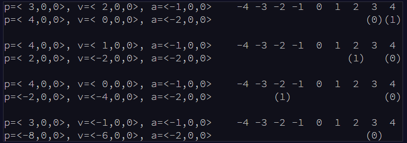
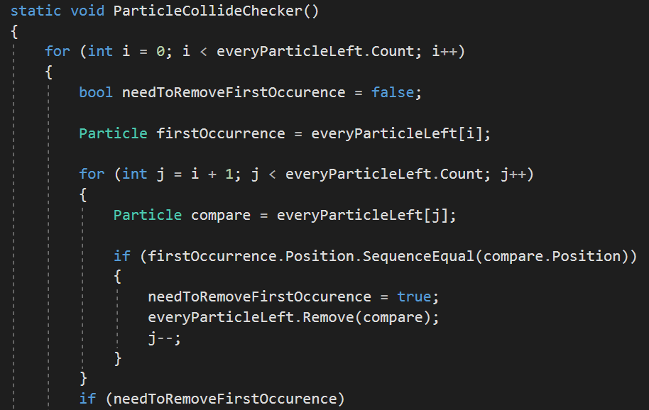

# [Day 20 - Paricle Swarm](http://adventofcode.com/2017/day/20)

## Part 1

>Suddenly, the GPU contacts you, asking for help. Someone has asked it to simulate too many particles,
and it won't be able to finish them all in time to render the next frame at this rate.
>
>It transmits to you a buffer (your puzzle input) listing each particle in order (starting with particle 0, then particle 1, particle 2,
and so on). For each particle, it provides the X, Y, and Z coordinates for the particle's position (p), velocity (v), and acceleration (a),
each in the format <X,Y,Z>.

Each tick of the clock, all of the particles get updated, based on the following set of rules
* Increase the X velocity by the X acceleration.
* Increase the Y velocity by the Y acceleration.
* Increase the Z velocity by the Z acceleration.
* Increase the X position by the X velocity.
* Increase the Y position by the Y velocity.
* Increase the Z position by the Z velocity.

The GPU would like to know which particle will stay closest to the origin over the course of this puzzle. We can measure this using 
the Manhattan distance, which in this solution is the sum of the absolute value of a particle's X, Y, and Z coordinates. 

An example of the way 2 particles would update would look like: 


In this example particle 1 will never become closer than particle 0 and so that would be our answer. But as usual our input is
significantly longer. 

To solve this we created a particle class with properties for Name, Position, Acceleration, and Velocity. Then we created all of our
particles from FileIO and ran them through 10,000 iterations while updating a Dictionary of each particles smallest value over the 
course of the updates. 
```
static void OneThousandIterations(List<Particle> particles)
{
    Dictionary<Particle, long> positions = new Dictionary<Particle, long>();

    for (int i = 0; i < 10000; i++)
    {
        foreach (Particle p in particles)
        {
            for (int j = 0; j < 3; j++)
            {
                p.Velocity[j] += p.Acceleration[j];
                p.Position[j] += p.Velocity[j];
            }
            if (positions.ContainsKey(p))
            {
                positions[p] = DistanceFromOriginCalculator(p);
            }
            else
            {
                positions.Add(p, DistanceFromOriginCalculator(p));
            }
        }
    }

    ClosestParticle(positions);
```

Aferwards we call the ClosestParticle method which reverse searches the dictionary to grab the key associated with the smallest 
distance. 

### Our Answer: 243

## Part 2

Part 2 is keeping things simple. The GPU now just wants us to remove any particles that have collided with other particles. A 
collision is based on 2 particles occupying the same position. The GPU would like to know how many particles are left after all is 
said and done. 

For this one 1000 iterations sufficed. We just added a new method to check for collisions and called to it after each iteration of Part
1's original solution. 



The lucky survivors were

## Our Answer: 648


