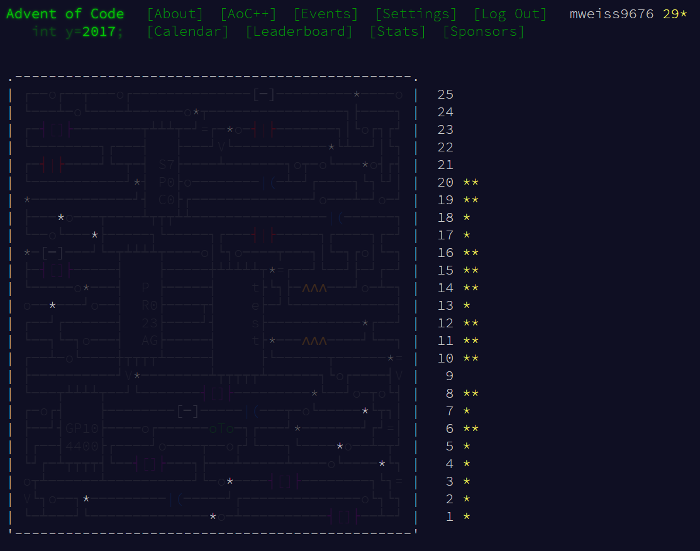

# [Advent of Code 2017](http://adventofcode.com/2017)
 daily programming challenges for the month of December, 2017 with a progressive difficulty scale

## Choose a Day for More Information

- [Day 10 - Knot Hash](../AdventCalendarCSharp/Day10/README.md)  
- [Day 11](https://github.com/mweiss9676/AdventCalendarCSharp/tree/master/Day11/README.md)  
- [Day 12](https://github.com/mweiss9676/AdventCalendarCSharp/tree/master/Day12/README.md)  
- [Day 13](https://github.com/mweiss9676/AdventCalendarCSharp/tree/master/Day13/README.md)  
- [Day 14](https://github.com/mweiss9676/AdventCalendarCSharp/tree/master/Day14/README.md)  
- [Day 15](https://github.com/mweiss9676/AdventCalendarCSharp/tree/master/Day15/README.md)
- [Day 16](https://github.com/mweiss9676/AdventCalendarCSharp/tree/master/Day16/README.md)
- [Day 17](https://github.com/mweiss9676/AdventCalendarCSharp/tree/master/Day17/README.md)
- [Day 18](https://github.com/mweiss9676/AdventCalendarCSharp/tree/master/Day18/README.md)
- [Day 19](https://github.com/mweiss9676/AdventCalendarCSharp/tree/master/Day19/README.md)
- [Day 20 - Particle Swarm](https://github.com/mweiss9676/AdventCalendarCSharp/tree/master/Day20/README.md)
